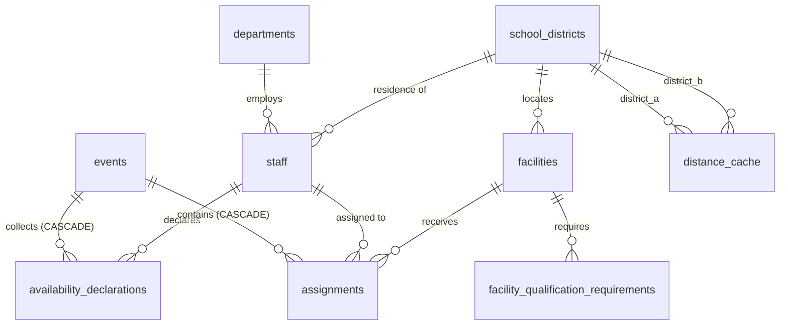

# ドメインエンティティ / データモデル — U-03 `data-management`

**作成日**: 2026-07-16
**ステージ**: CONSTRUCTION - Functional Design（ユニット 3 / 8）

---

## 1. U-03 は新たなドメインエンティティを定義しない

U-03 が永続化するドメイン型は、**すべて U-01 が定義済み**である。U-03 が新たに定義するのは、**DB テーブルのスキーマ**と、**行 ↔ ドメイン型のマッパ**である。

| ドメイン型（U-01） | 対応するテーブル |
|------------------|----------------|
| `Department` | `departments` |
| `SchoolDistrict` | `school_districts` |
| `Staff` | `staff` |
| `Facility` + `QualificationRequirement` | `facilities` + `facility_qualification_requirements` |
| `Event` | `events` |
| `AvailabilityDeclaration` | `availability_declarations` |
| `Assignment` | `assignments` |
| `AssignmentResult` + `ConstraintViolation` | `assignment_results` + `constraint_violations` |
| `HistoricalRecord` | `historical_records`（実績割当 + 当時の申告） |
| `DistanceCacheEntry`（U-02） | `distance_cache` |

**割当結果・ジョブ・セッション・監査ログ**は U-04/U-06 が所有するが、外部キーの整合のため、初期マイグレーションでは U-03 が全テーブルの骨格を作る（Q6=A）。ただし**各テーブルのビジネスロジックは所有ユニットが実装する**。

---

## 2. 永続化方式（Q1=A）: SQLAlchemy Core + 手書きマッパ

### 2.1 なぜ Core か

U-01 のドメイン型はすべて **frozen** である。SQLAlchemy の ORM は属性変更を追跡（ダーティチェック）するが、frozen 型では属性を変更できない。

**SQLAlchemy Core（テーブル定義 + 明示的な SELECT/INSERT/UPDATE）** を採用する。

```text
  DB 行  --(マッパ関数 row_to_staff)-->  Staff（ドメイン型、frozen）
  Staff  --(マッパ関数 staff_to_params)-->  INSERT/UPDATE のパラメータ
```

### 2.2 この方式の利点

| 利点 | 内容 |
|------|------|
| ドメインの純粋性 | ドメイン型は ORM を一切知らない。ヘキサゴナルの依存規則を保つ |
| **DB の不正データで fail closed** | 行からドメイン型を再構築する際、`__post_init__` が再実行される。DB に緯度 95.0 のような不正値が混入していれば、その場で `InvalidCoordinatesError` になる（SECURITY-15） |
| SQLite → PostgreSQL 移行 | Core は SQLite 固有 SQL を避けやすい。方言差は SQLAlchemy が吸収する（U01-H18） |

### 2.3 マッパの配置

`A-02 PersistenceAdapter`（U-03）内に、テーブルごとのマッパ関数を置く。ドメイン型には一切変更を加えない。

---

## 3. テーブルスキーマ

**すべての日時列は UTC で保存する。例外は `events.scheduled_date` のみで、これは JST の暦日（`DATE` 型、時刻成分なし）である**（U01-H12）。

### 3.1 `departments`

| 列 | 型 | 制約 |
|----|----|----|
| `id` | `TEXT` | PK |
| `name` | `TEXT` | NOT NULL |
| `concurrent_assignment_cap` | `INTEGER` | NULL 可 |

### 3.2 `school_districts`

| 列 | 型 | 制約 |
|----|----|----|
| `id` | `TEXT` | PK |
| `name` | `TEXT` | NOT NULL |
| `latitude` | `REAL` | NOT NULL |
| `longitude` | `REAL` | NOT NULL |

### 3.3 `staff`

| 列 | 型 | 制約 |
|----|----|----|
| `id` | `TEXT` | PK |
| `name` | `TEXT` | NOT NULL（**個人情報**） |
| `department_id` | `TEXT` | FK → departments(id) |
| `job_type` | `TEXT` | NOT NULL（英語識別子） |
| `position` | `TEXT` | NOT NULL（英語識別子） |
| `residence_district_id` | `TEXT` | FK → school_districts(id)（**個人情報**） |

職員の資格は多対多: `staff_qualifications(staff_id, qualification)`。

### 3.4 `facilities` + `facility_qualification_requirements`

`facilities`:

| 列 | 型 | 制約 |
|----|----|----|
| `id` | `TEXT` | PK |
| `name` | `TEXT` | NOT NULL |
| `district_id` | `TEXT` | FK → school_districts(id) |
| `required_headcount` | `INTEGER` | NOT NULL, CHECK >= 1 |

`facility_qualification_requirements`:

| 列 | 型 | 制約 |
|----|----|----|
| `facility_id` | `TEXT` | FK → facilities(id) ON DELETE CASCADE |
| `requirement` | `TEXT` | NOT NULL（資格/役職/職種の識別子） |
| `required_count` | `INTEGER` | NOT NULL |
| | | PK(facility_id, requirement) |

### 3.5 `events`

| 列 | 型 | 制約 |
|----|----|----|
| `id` | `TEXT` | PK |
| `type` | `TEXT` | NOT NULL |
| `name` | `TEXT` | NOT NULL |
| `scheduled_date` | `DATE` | NOT NULL（**JST の暦日**、U01-H12） |
| `status` | `TEXT` | NOT NULL |

### 3.6 `availability_declarations`（Q2=A、Q3=A）

**単一の追記専用テーブル。有効な申告はクエリ時に決める。**

| 列 | 型 | 制約 |
|----|----|----|
| `staff_id` | `TEXT` | FK → staff(id) |
| `event_id` | `TEXT` | FK → events(id) ON DELETE CASCADE |
| `is_available` | `BOOLEAN` | NOT NULL |
| `reason_category` | `TEXT` | NULL 可 |
| `other_reason_note` | `TEXT` | NULL 可 |
| `declared_at` | `TIMESTAMP` | NOT NULL（**UTC**） |
| | | **UNIQUE(staff_id, event_id, declared_at)**（U01-H11、Q3=A） |
| | | INDEX(staff_id, event_id, declared_at DESC)（最新取得の高速化） |

**有効な申告の取得**: `(staff_id, event_id)` ごとに `declared_at` が最大の行。SQL のウィンドウ関数または相関サブクエリで取得する（SQLite・PostgreSQL 両対応）。

### 3.7 `assignments`

| 列 | 型 | 制約 |
|----|----|----|
| `event_id` | `TEXT` | FK → events(id) ON DELETE CASCADE |
| `staff_id` | `TEXT` | FK → staff(id) |
| `facility_id` | `TEXT` | FK → facilities(id) |
| `is_pinned` | `BOOLEAN` | NOT NULL DEFAULT false |
| | | **PK(event_id, staff_id)**（INV-01 を DB でも保証） |

### 3.8 `distance_cache`（U02-H3, H4）

| 列 | 型 | 制約 |
|----|----|----|
| `district_a` | `TEXT` | **正規化後の小さい方の ID** |
| `district_b` | `TEXT` | **正規化後の大きい方の ID** |
| `great_circle_km` | `REAL` | NOT NULL（**大円距離のみ**） |
| | | PK(district_a, district_b) |
| | | CHECK(district_a <= district_b)（正規化の保証） |

### 3.9 その他のテーブル（骨格のみ U-03 が作成、ロジックは所有ユニット）

- `assignment_results`, `constraint_violations` — U-04 が使用
- `historical_records`, `historical_assignments`, `historical_declarations` — U-05 が使用
- `optimization_jobs` — U-04 が使用
- `sessions` — U-06 が使用
- （監査ログは DB テーブルではなく OS レベルの追記専用ファイル。shared-infrastructure.md）

---

## 4. エンティティ関連図



### テキスト代替

```text
departments      1--N staff
school_districts 1--N staff              (residence)
school_districts 1--N facilities         (location)
facilities       1--N facility_qualification_requirements  (ON DELETE CASCADE)
events           1--N availability_declarations            (ON DELETE CASCADE)
staff            1--N availability_declarations
  UNIQUE(staff_id, event_id, declared_at)
events           1--N assignments                          (ON DELETE CASCADE)
  PK(event_id, staff_id)  -- INV-01 at the DB level
distance_cache: PK(district_a, district_b), CHECK(district_a <= district_b)
```

---

## 5. マイグレーション（Q6=A、U01-H18）

- **U-03 で Alembic を初期化する。** `alembic/` ディレクトリ、`alembic.ini`、初期リビジョン
- 初期マイグレーションで、上記の全テーブルを作成する（骨格を含む）
- **SQLite 固有の SQL を書かない。** SQLAlchemy の型と制約で表現し、方言差は SQLAlchemy に吸収させる
- 以降のユニット（U-04, U-06）は、必要ならマイグレーションを追加する
- **マイグレーションは接続文字列を変えるだけで PostgreSQL にも適用できる**

---

## 6. SQLite の必須設定（U01-H15）

接続確立時に、以下の PRAGMA を必ず適用する。SQLAlchemy の `connect` イベントで設定する。

| PRAGMA | 値 |
|--------|----|
| `journal_mode` | `WAL` |
| `busy_timeout` | `5000`（ms 以上） |
| `foreign_keys` | `ON`（SQLite は既定で外部キーを強制しないため） |

**`foreign_keys = ON` が特に重要である。** これがないと、ON DELETE CASCADE（Q5=A）も外部キー制約（参照整合性）も機能しない。PostgreSQL では既定で有効。

---

## 7. 後続への申し送り（新規）

| ID | 事項 | 引き渡し先 |
|----|------|-----------|
| **U03-H1** | `assignment_results`, `constraint_violations` テーブルの骨格は U-03 が作成済み。ビジネスロジック（保存・取得）は U-04 が実装する | U-04 |
| **U03-H2** | `historical_records` 系テーブルの骨格は U-03 が作成済み。取り込みロジックは U-05 が実装する | U-05 |
| **U03-H3** | `optimization_jobs`, `sessions` テーブルの骨格は U-03 が作成済み。ロジックは U-04, U-06 が実装する | U-04, U-06 |
| **U03-H4** | 全ドメイン型のマッパ（行 ↔ ドメイン型）は `A-02 PersistenceAdapter` にある。他ユニットのリポジトリはこれを再利用するか、同じパターンで実装する | U-04, U-05, U-06 |
