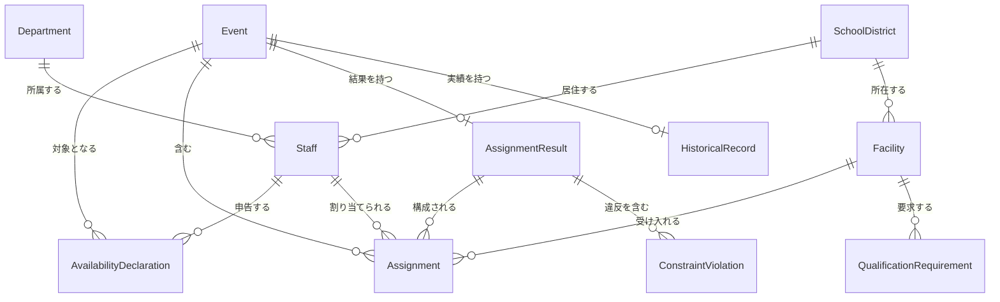

# ドメインエンティティ — U-01 `shared-kernel`

**作成日**: 2026-07-09
**ステージ**: CONSTRUCTION - Functional Design（ユニット 1 / 8）

**技術非依存**。プログラミング言語、DB 製品、ORM に依存しない設計である。技術スタックは NFR Requirements ステージで決定する。

---

## 1. 確定した設計判断

| # | 判断 | 選択 | 出典 |
|---|------|------|------|
| 1 | 識別子の体系 | **すべて自然キー**（既存システムの ID をそのまま使う） | Q1=A |
| 2 | 部署 | **独立エンティティ `Department`** | Q2=B |
| 3 | 距離の数値型 | **浮動小数点 + 許容誤差 ε** | Q3=A |
| 4 | 移動時間の粒度 | **秒単位の整数** | Q4=C |
| 5 | 移動費用 | **内部は実数。表示・エクスポート時のみ整数円に丸める** | Q5=B |
| 6 | `Event` のステータス | **準備中 → 申告受付中 → 割当計算済 → 確定** の 4 状態 | Q6=A |
| 7 | 施設の資格要件 | **`(資格または役職, 必要人数)` のリスト** | Q7=A |
| 8 | 職員の多重度 | **職種 1、役職 1、資格は複数** | Q8=A |
| 9 | 従事可否の理由区分 | **列挙型 4 値 + 「その他」の自由記述補足** | Q9=A |
| 10 | 日時 | **UTC で保持し、表示時に JST へ変換** | Q10=A |
| 11 | `AssignmentResult` | **`violations[]` を持つ** | Q11=A |
| 12 | 不公平性の指標 | **最大移動時間の最小化（ミニマックス）** | Q12=A |

---

## 2. エンティティ関連図



### テキスト代替

```text
Department  1 --- N  Staff                    （職員は 1 つの部署に所属する）
SchoolDistrict 1 --- N  Staff                 （職員は 1 つの小学校区に居住する）
SchoolDistrict 1 --- N  Facility              （施設は 1 つの小学校区に所在する）
Facility    1 --- N  QualificationRequirement （施設は複数の資格要件を持つ）

Event       1 --- N  AvailabilityDeclaration  （イベントに対して申告が集まる）
Staff       1 --- N  AvailabilityDeclaration  （職員は複数イベントに申告する）
  ※ AvailabilityDeclaration の識別は (staffId, eventId, declaredAt) の 3 つ組

Event       1 --- N  Assignment               （イベントの割当）
Staff       1 --- N  Assignment               （同一イベント内では高々 1 件。INV-01）
Facility    1 --- N  Assignment

Event       1 --- 0..1 AssignmentResult
AssignmentResult 1 --- N  Assignment
AssignmentResult 1 --- N  ConstraintViolation （C3 降格時のみ非空）

Event       1 --- 0..1 HistoricalRecord       （過去実績が存在するイベントのみ）
```

---

## 3. エンティティ定義

### 3.1 `Department`（部署）

| 属性 | 型 | 必須 | 説明 |
|------|----|:----:|------|
| `id` | `DepartmentId`（自然キー） | ○ | 庁内の部署コード |
| `name` | `String` | ○ | 部署名 |
| `concurrentAssignmentCap` | `Integer \| null` | | この部署から同時に割り当てられる人数の上限。`null` の場合は全体の既定値を用いる（制約 C5） |

**設計判断（Q2=B）**: 独立エンティティとすることで、表記ゆれ（「危機管理課」「危機管理担当課」）を防ぐ。また `concurrentAssignmentCap` を部署ごとに設定できるため、C5 の「部署ごとに異なる上限」を将来表現できる。本 PoC では既定値のみを用いてよい。

---

### 3.2 `SchoolDistrict`（小学校区）

| 属性 | 型 | 必須 | 説明 |
|------|----|:----:|------|
| `id` | `SchoolDistrictId`（自然キー） | ○ | 行政の校区コード |
| `name` | `String` | ○ | 小学校区名 |
| `representativePoint` | `Coordinates` | ○ | 代表点。**当該小学校の所在地座標**（A-02, CQ6=A） |

**不変条件**: `representativePoint` は緯度 `[-90, 90]`、経度 `[-180, 180]` の範囲内にある（US-09）。

---

### 3.3 `Staff`（職員）

| 属性 | 型 | 必須 | 説明 |
|------|----|:----:|------|
| `id` | `StaffId`（自然キー） | ○ | 人事システムの職員番号 |
| `name` | `String` | ○ | 氏名。**個人情報。ログに出力してはならない**（SECURITY-03、NFR-S02） |
| `departmentId` | `DepartmentId` | ○ | 所属部署 |
| `jobType` | `JobType` | ○ | 職種。**1 つのみ**（Q8=A） |
| `position` | `Position` | ○ | 役職。**1 つのみ**（Q8=A） |
| `qualifications` | `Set<Qualification>` | ○ | 保有資格。**複数可**（Q8=A）。空集合を許す |
| `residenceDistrictId` | `SchoolDistrictId` | ○ | 居住小学校区。**個人情報**（SECURITY-03） |

**設計判断（Q8=A）**: 役職を 1 つに限ることで、「責任者は管理職に限る」という C3 の要件を型レベルで表現しやすくなる。資格は複数保有可能とする。

**PoC における個人情報の扱い**: 過去実績データは仮名化して投入する（氏名を職員 ID に置換、CQ7=B）。`name` は表示・エクスポート用途に限る。

---

### 3.4 `Facility`（施設 / 避難所）

| 属性 | 型 | 必須 | 説明 |
|------|----|:----:|------|
| `id` | `FacilityId`（自然キー） | ○ | 避難所の管理番号 |
| `name` | `String` | ○ | 施設名 |
| `districtId` | `SchoolDistrictId` | ○ | 所在小学校区 |
| `requiredHeadcount` | `PositiveInteger` | ○ | 必要人数（制約 C1） |
| `qualificationRequirements` | `List<QualificationRequirement>` | ○ | 資格要件。空リストを許す |

#### `QualificationRequirement`（値オブジェクト）

| 属性 | 型 | 説明 |
|------|----|------|
| `requirement` | `Qualification \| Position \| JobType` | 要求する資格・役職・職種のいずれか |
| `requiredCount` | `PositiveInteger` | 必要人数 |

**不変条件**（US-08）: 各施設について、**資格別必要人数の合計 ≤ 施設の必要人数**。

すなわち `sum(qualificationRequirements[].requiredCount) <= requiredHeadcount`。

**設計判断（Q7=A）**: 上限を持たせない（下限のみ）。要件に上限の記述がないため。

---

### 3.5 `Event`（イベント）

| 属性 | 型 | 必須 | 説明 |
|------|----|:----:|------|
| `id` | `EventId`（自然キー） | ○ | |
| `type` | `EventType` | ○ | `DisasterShelterSupport` / `ElectionAdministration` / `Other`（FR-01.1） |
| `name` | `String` | ○ | |
| `scheduledDate` | `Date`（UTC） | ○ | 実施日 |
| `status` | `EventStatus` | ○ | 下記のステータス遷移を参照 |

#### `EventStatus`（Q6=A）

```text
   Draft（準備中）
        |
        |  担当者が申告受付を開始する
        v
   CollectingDeclarations（申告受付中）
        |
        |  最適化ジョブが正常に完了する
        v
   Optimized（割当計算済）
        |
        |  担当者が割当を確定する
        v
   Confirmed（確定）
```

**ステータス遷移規則の詳細は `business-rules.md` を参照。**

**設計判断（Q6=A）**: 4 状態とすることで、以下を表現できる。
- 「申告を締め切ったか」（`Draft` → `CollectingDeclarations`）
- 「割当を計算したか」（`Optimized`）
- 「確定済みイベントは削除できない」（US-06、`Confirmed` の削除を禁止）

**PoC の検証対象**: `type = DisasterShelterSupport` のみ（FR-01.3）。他の種別も登録できるが動作検証は行わない。

---

### 3.6 `AvailabilityDeclaration`（従事可否申告）

**本システムの設計上、最も重要なエンティティ。** 従事可否は職員の属性ではなく、**（職員, イベント）の組に対する属性**である（FR-02.7, R3-CQ3=A）。

| 属性 | 型 | 必須 | 説明 |
|------|----|:----:|------|
| `staffId` | `StaffId` | ○ | |
| `eventId` | `EventId` | ○ | |
| `isAvailable` | `Boolean` | ○ | 従事可能か |
| `reasonCategory` | `ReasonCategory \| null` | | `isAvailable = false` の場合に必須 |
| `otherReasonNote` | `String \| null` | | `reasonCategory = Other` の場合のみ設定可（Q9=A） |
| `declaredAt` | `Timestamp`（UTC） | ○ | 申告日時 |

#### `ReasonCategory`（Q9=A）

```text
Leave            （休暇）
ChildOrElderCare （育児・介護）
HealthConsideration（健康上の配慮）
Other            （その他 — otherReasonNote に自由記述）
```

**識別**: `(staffId, eventId, declaredAt)` の 3 つ組。**同一の `(staffId, eventId)` に対して複数の申告が存在しうる**（再申告の履歴、US-12）。

**不変条件（U-01 が検証責任を持つ）**: 同一の `(staffId, eventId)` に対する申告のうち、**有効なものはちょうど 1 件**（最新の `declaredAt` を持つもの）である。

**設計判断（Q9=A）**: 理由区分を列挙型とすることで集計可能にしつつ、`Other` に自由記述を許すことで例外を記録できる。

---

### 3.7 `Assignment`（割当）

| 属性 | 型 | 必須 | 説明 |
|------|----|:----:|------|
| `eventId` | `EventId` | ○ | |
| `staffId` | `StaffId` | ○ | |
| `facilityId` | `FacilityId` | ○ | |
| `isPinned` | `Boolean` | ○ | 担当者が手動で固定したか（US-23, US-24） |

**識別**: `(eventId, staffId)`。

**不変条件（INV-01）**: 同一イベント内で、1 職員は高々 1 つの `Assignment` を持つ。この不変条件は識別子の選択そのものによって型レベルで保証される。

---

### 3.8 `AssignmentResult`（割当結果）

| 属性 | 型 | 必須 | 説明 |
|------|----|:----:|------|
| `eventId` | `EventId` | ○ | |
| `assignments` | `List<Assignment>` | ○ | |
| `objectiveValue` | `Real` | ○ | 目的関数値 |
| `optimalityGap` | `Ratio` | ○ | 最適性ギャップ。厳密解なら 0（US-20） |
| `solverStatus` | `SolverStatus` | ○ | `Optimal` / `TimeLimitReached` / `Cancelled` |
| `violations` | `List<ConstraintViolation>` | ○ | **C3 降格時のみ非空**（Q11=A, US-19） |
| `computedAt` | `Timestamp`（UTC） | ○ | |

#### `ConstraintViolation`（値オブジェクト）

| 属性 | 型 | 説明 |
|------|----|------|
| `constraintId` | `"C1" \| "C2" \| "C3" \| "C4" \| "C5"` | 違反した制約 |
| `facilityId` | `FacilityId \| null` | |
| `staffId` | `StaffId \| null` | |
| `detail` | `String` | 例: 「管理職が 1 名不足」 |

**設計判断（Q11=A）**: 違反情報を結果に保持することで、UI が表示のたびに再計算する必要がなくなる。

**不変条件（INV-06）**: `objectiveValue` は有限かつ非負である。

**不変条件**: `violations` に `"C1"`, `"C2"`, `"C4"`, `"C5"` が現れることはない。これらの制約は決して降格されないため（FR-04.5）。**降格されるのは C3 のみ。**

---

### 3.9 `HistoricalRecord`（過去実績）

| 属性 | 型 | 必須 | 説明 |
|------|----|:----:|------|
| `eventId` | `EventId` | ○ | |
| `actualAssignments` | `List<Assignment>` | ○ | 実際に従事した職員と施設の対応 |
| `availabilityDeclarations` | `List<AvailabilityDeclaration>` | ○ | 当時の従事可否申告（A-10） |

**不変条件**（US-26、検証責任は U-05）:
- 実績の割当職員集合 ⊆ 従事可能と申告した職員集合
- 各施設について、実績の割当人数 == 導出された必要人数（定義により）

**PoC での取り扱い**: 仮名化されたデータを投入する（氏名を職員 ID に置換、CQ7=B）。

---

## 4. 値オブジェクト

### 4.1 `Coordinates`（座標）

| 属性 | 型 |
|------|----|
| `latitude` | `Real` |
| `longitude` | `Real` |

**生成時バリデーション**: 緯度 `[-90, 90]`、経度 `[-180, 180]`。範囲外は生成を拒否する（fail closed / SECURITY-15）。

---

### 4.2 `TravelMetrics`（移動指標）

| 属性 | 型 | 単位 | 根拠 |
|------|----|------|------|
| `distanceKm` | `Real` | km | Q3=A（浮動小数点 + 許容誤差 ε） |
| `timeSeconds` | `NonNegativeInteger` | **秒** | Q4=C |
| `costYen` | `Real` | 円 | Q5=B（内部は実数。表示・エクスポート時のみ整数円に丸める） |

#### 設計判断の詳細

**`timeSeconds` が秒単位の整数である理由（Q4=C）**: 各職員の移動時間を**分単位に丸めてから**集計すると、2,000 人分で最大 1,000 分（約 17 時間）の誤差が生じうる。秒単位なら誤差は実質無視できる。表示時に分へ変換する。

**`costYen` が実数である理由（Q5=B）**: 各職員の費用を整数円に丸めてから集計すると同様の累積誤差が生じる。内部は実数で保持し、画面表示と CSV エクスポート時にのみ整数円へ丸める。目的関数も実数で扱える。

**`distanceKm` の許容誤差（Q3=A）**: 後述のセクション 6 を参照。

---

### 4.3 `ObjectiveWeights`（目的関数の重み）

| 属性 | 型 | 説明 |
|------|----|------|
| `travelTime` | `NonNegativeReal` | 総移動時間の重み |
| `travelCost` | `NonNegativeReal` | 総移動費用の重み |
| `inequity` | `NonNegativeReal` | **最大移動時間**の重み（Q12=A） |

**不変条件**（US-17）: すべての重みが非負であり、**少なくとも 1 つが正**である。すべてが 0 の場合、目的関数が定数となり最適化が意味を失うため、生成を拒否する。

**設計判断（Q12=A）**: 不公平性の指標を「**最大移動時間の最小化（ミニマックス）**」と定める。分散の最小化は二次計画問題となり MILP ソルバーでは直接扱えないが、最大移動時間の最小化は補助変数 1 つで線形に表現できる。職員にとっても「最も遠くへ行かされる人の移動時間を短くする」という説明が容易である。

**U-04 への申し送り**: 目的関数の定式化は `min( w1 * Σt_i + w2 * Σc_i + w3 * T_max )`。ここで `T_max >= t_i (∀i)` を制約として加え、`T_max` を最小化対象の補助変数とする。

---

### 4.4 `TravelParameters`（算出パラメータ）

| 属性 | 型 | 既定値 | 説明 |
|------|----|--------|------|
| `detourFactor` | `Real >= 1.0` | 1.3 | 迂回係数 |
| `averageSpeedKmh` | `PositiveReal` | 30.0 | 平均移動速度 |
| `unitPricePerKm` | `NonNegativeReal` | （担当者が設定） | 距離単価（円/km） |
| `sameDistrictFixedSeconds` | `NonNegativeInteger` | 900（= 15 分） | 同一小学校区の固定移動時間 |

**すべて設定として外部化する。ハードコードしない**（NFR-M03）。

**申し送り H-1（U-02 の Functional Design）**: `unitPricePerKm` による線形費用モデルは、当初の課題である「タクシー費用の高額化」の非線形性（距離帯による交通手段の切替）を捉えない。U-02 の Functional Design で距離帯モデルへの拡張を再検討する。**なお `TravelParameters` を値オブジェクトとして分離したことで、距離帯モデルへの差し替えは U-01 の型変更のみで済む。**

---

### 4.5 `OptimizationParameters`（最適化パラメータ）

| 属性 | 型 | 説明 |
|------|----|------|
| `weights` | `ObjectiveWeights` | |
| `timeLimitSeconds` | `PositiveInteger` | 既定値 300（NFR-P02） |
| `departmentCapLimit` | `PositiveInteger` | 部署ごとの上限人数の既定値（C5） |
| `allowC3Demotion` | `Boolean` | C3 をソフト制約に降格するか（FR-04.5） |
| `randomSeed` | `Integer` | 再現性のため（INV-11、PBT-08） |

---

### 4.6 `AssignmentProblem`（割当問題の構成）

| 属性 | 型 | 説明 |
|------|----|------|
| `event` | `Event` | |
| `facilities` | `List<Facility>` | |
| `availableStaff` | `List<Staff>` | **従事可能と申告した職員のみ**（FR-04.1） |
| `travelMatrix` | `Map<(StaffId, FacilityId), TravelMetrics>` | 事前計算された移動指標 |
| `pinnedAssignments` | `List<Assignment>` | ピン留めされた割当（US-23, US-24） |
| `parameters` | `OptimizationParameters` | |

**不変条件（INV-05）**: 最適化結果の割当職員集合 ⊆ `availableStaff`。

---

## 5. 型の別名（Type Aliases）

自然キー（Q1=A）を型として区別することで、識別子の取り違えをコンパイル時に検出する。

```text
StaffId          : String（人事システムの職員番号）
FacilityId       : String（避難所の管理番号）
SchoolDistrictId : String（行政の校区コード）
DepartmentId     : String（庁内の部署コード）
EventId          : String

JobType          : 列挙型（NFR Requirements で具体値を確定）
Position         : 列挙型（管理職を含む）
Qualification    : 列挙型（防災士など）
```

**設計判断（Q1=A）**: すべて自然キーとすることで、CSV インポートが単純になる（自然キー → サロゲートキーの解決が不要）。外部システムとの突合も容易である。ただし、識別子を単なる `String` として扱うと取り違えが起こるため、**型レベルで区別する**。

---

## 6. 浮動小数点の対称性 — INV-07 の再定義（重要）

### 6.1 問題

`INV-07` は当初「距離関数は対称である: `distance(a, b) == distance(b, a)`」と定めていた。

Q3=A（浮動小数点 + 許容誤差）と Q4=C（秒単位の整数）を組み合わせると、次の問題が生じる。

1. Haversine 距離を浮動小数点で計算すると、引数の順序で丸め誤差が変わりうる
2. その距離から移動時間を秒に丸めると、**境界で 1 秒ずれうる**
3. 結果として、移動時間の対称性まで許容誤差付きになる

### 6.2 解決（採用する設計）

**U-02 の距離キャッシュは `(小学校区, 小学校区)` の組でキーされる**（Application Design、Q4=A）。このキーを **`(min(id), max(id))` に正規化**する。

すると、`distance(a, b)` と `distance(b, a)` は**同一のキャッシュエントリを引く**ため、返る値は**ビット単位で同一**である。対称性は構造的に厳密となり、許容誤差を要さない。

### 6.3 INV-07 の分割

| ID | 不変条件 | 検証方法 | 検証責任 |
|----|---------|---------|---------|
| **INV-07a** | 生の Haversine 関数の対称性: `\|haversine(a,b) - haversine(b,a)\| < ε`（ε = 1e-9 km） | 許容誤差付きのプロパティテスト（PBT-02 の「損失のある変換は許容偏差を文書化する」に従う） | U-02 |
| **INV-07b** | キャッシュ経由の対称性: `cachedDistance(a,b) == cachedDistance(b,a)` | **厳密等価**のプロパティテスト。キーの正規化により構造的に成立する | U-02 |

**U-02 の Functional Design への申し送り**: キャッシュキーの正規化（`(min(id), max(id))`）を必ず実装すること。これが本設計の前提である。

### 6.4 INV-09 の再定義

`INV-09`（迂回係数の単調性）も、秒単位の丸め（Q4=C）の影響を受ける。迂回係数をごくわずかに増やしても、丸め後の秒が変わらないことがある。

**したがって INV-09 は「単調非減少」として定義する。厳密な単調増加ではない。**

```text
INV-09: detourFactor_1 <= detourFactor_2  =>  travelTimeSeconds(d, detourFactor_1) <= travelTimeSeconds(d, detourFactor_2)
```

厳密な単調増加を要求するプロパティテストは、丸め境界の入力で失敗する。

---

## 7. Testable Properties（PBT-01、申し送り H-2）

**PBT-01 はブロッキング制約である。** U-01 が検証責任を持つプロパティを以下に列挙する。

| ID | プロパティ | 分類 | 対象 |
|----|-----------|------|------|
| **P-01** | 同一の `(staffId, eventId)` に対する申告のうち、`effectiveDeclarationFor()` が返すのはちょうど 1 件であり、それは最大の `declaredAt` を持つものである | **Invariant** | `AvailabilityDeclaration` |
| **P-02** | `effectiveDeclarationFor()` は冪等である: 同一の履歴に対し何度呼んでも同じ結果を返す | **Idempotence** | `AvailabilityDeclaration` |
| **P-03** | `Coordinates` の生成は、緯度 `[-90, 90]` かつ経度 `[-180, 180]` の入力に対してのみ成功する | **Invariant**（Range constraint） | `Coordinates` |
| **P-04** | `ObjectiveWeights` の生成は、すべての重みが非負かつ少なくとも 1 つが正である入力に対してのみ成功する | **Invariant**（Range constraint） | `ObjectiveWeights` |
| **P-05** | `Facility` の生成は、資格別必要人数の合計 ≤ 必要人数 を満たす入力に対してのみ成功する | **Invariant** | `Facility` |
| **P-06** | `Assignment` の集合において、同一 `(eventId, staffId)` の要素は高々 1 つである（INV-01 の型レベル保証） | **Invariant** | `Assignment` |
| **P-07** | `AssignmentResult.violations` に `"C1"`, `"C2"`, `"C4"`, `"C5"` が現れない | **Invariant** | `AssignmentResult` |
| **P-08** | `TravelParameters` の生成は、`detourFactor >= 1.0` かつ `averageSpeedKmh > 0` の入力に対してのみ成功する | **Invariant**（Range constraint） | `TravelParameters` |

### 7.1 PBT 対象のプロパティを持たないコンポーネント

| コンポーネント | 判定 | 根拠 |
|--------------|------|------|
| `Department`, `SchoolDistrict`, `Staff`, `Event` | **No PBT properties identified beyond generation validation** | 属性の保持のみを行い、振る舞いを持たない。生成時バリデーションは P-03（`Coordinates`）に集約される |
| `HistoricalRecord` | **PBT properties belong to U-05** | 不変条件（実績の割当職員集合 ⊆ 従事可能職員集合など）は、U-05 `comparison-report` が検証責任を持つ |

### 7.2 ドメイン生成器（PBT-07、Code Generation への申し送り）

PBT-07 は「ドメイン固有の生成器を用いること。生の primitive 生成器のみを使ってはならない」と定める。U-01 は以下の生成器を**再利用可能なテストユーティリティ**として提供する。

| 生成器 | 生成する値の制約 |
|-------|----------------|
| `genCoordinates()` | 緯度 `[-90, 90]`、経度 `[-180, 180]`。境界値（±90, ±180, 0）を含む |
| `genSchoolDistrict()` | 妥当な `Coordinates` を持つ |
| `genStaff()` | 職種 1、役職 1、資格 0 個以上。既存の `DepartmentId`, `SchoolDistrictId` を参照する |
| `genFacility()` | 資格別必要人数の合計 ≤ 必要人数 を満たす |
| `genAvailabilityDeclaration()` | `isAvailable = false` なら `reasonCategory` が非 null。`reasonCategory = Other` なら `otherReasonNote` が非 null |
| `genObjectiveWeights()` | 全重みが非負、少なくとも 1 つが正 |
| `genTravelParameters()` | `detourFactor >= 1.0`, `averageSpeedKmh > 0` |
| `genAssignmentProblem()` | 上記を組み合わせ、構造的に妥当な問題を生成する |

**これらの生成器は U-02〜U-07 のすべてのプロパティベーステストから利用される。** 生成器の実装は Code Generation ステージで行う。

---

## 8. 後続ユニットへの申し送り

| ID | 事項 | 引き渡し先 |
|----|------|-----------|
| **U01-H1** | 距離キャッシュのキーを `(min(id), max(id))` に正規化すること。INV-07b（厳密な対称性）の前提である | **U-02** distance-cost |
| **U01-H2** | INV-07 を INV-07a（許容誤差 ε = 1e-9 km）と INV-07b（厳密等価）に分割した。両方をプロパティテストで検証すること | **U-02** distance-cost |
| **U01-H3** | INV-09 は「単調非減少」である。厳密な単調増加ではない（秒単位の丸めのため） | **U-02** distance-cost |
| **U01-H4** | H-1（線形費用モデルの再検討）。`TravelParameters` を値オブジェクトとして分離したため、距離帯モデルへの差し替えは U-01 の型変更のみで済む | **U-02** distance-cost |
| **U01-H5** | 目的関数の定式化は `min( w1*Σt_i + w2*Σc_i + w3*T_max )`、制約 `T_max >= t_i (∀i)`。ミニマックスは補助変数 1 つで線形に表現できる（Q12=A） | **U-04** optimization-engine |
| **U01-H6** | `AssignmentResult.violations` に現れうる制約 ID は `"C3"` のみ。他の制約は降格されない | **U-04** optimization-engine |
| **U01-H7** | ドメイン生成器 8 種を U-01 のテストユーティリティとして実装し、全ユニットから再利用する（PBT-07） | **Code Generation（全ユニット）** |
| **U01-H8** | `Staff.name` と `Staff.residenceDistrictId` は個人情報である。監査ログには職員 ID のみを記録する（SECURITY-03） | **U-06** security |
| **U01-H9** | `JobType`, `Position`, `Qualification` の具体的な列挙値は NFR Requirements ステージで確定する | **U-01** NFR Requirements |
