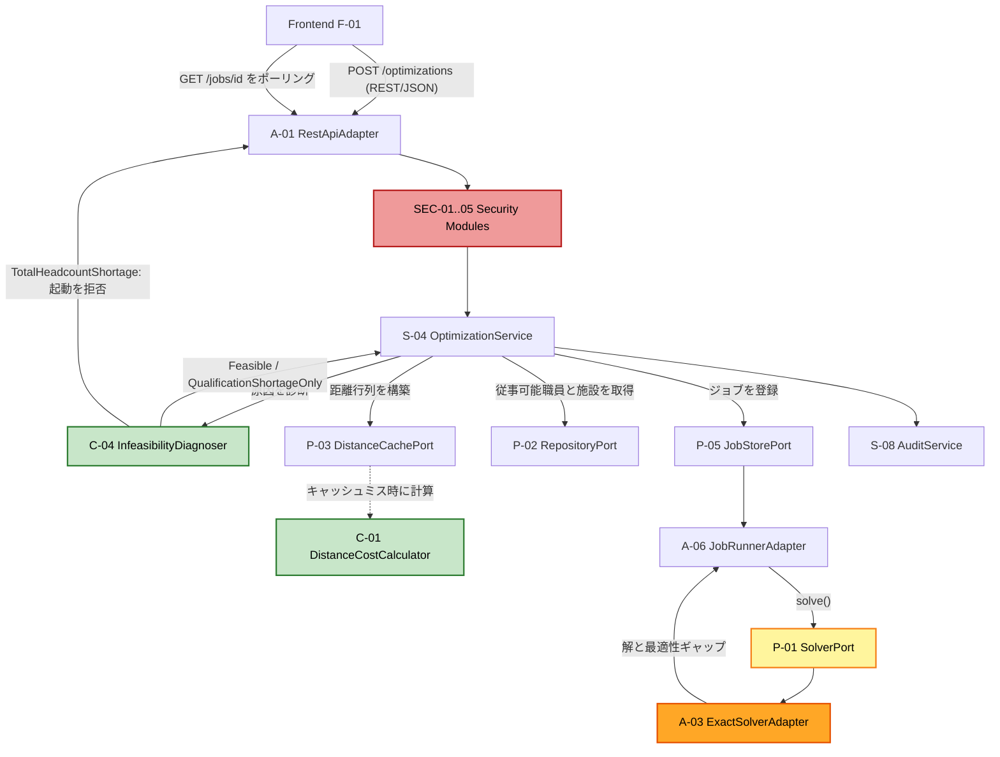
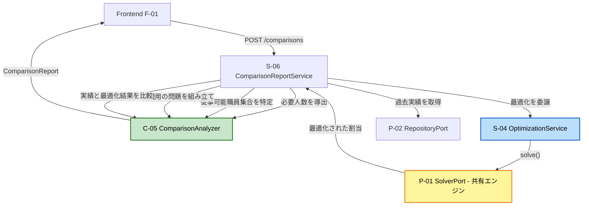

# コンポーネント依存関係（Component Dependency）

**作成日**: 2026-07-09
**ステージ**: INCEPTION - Application Design

---

## 1. 依存規則（Dependency Rule）

ヘキサゴナルアーキテクチャ（Q1=B）における**唯一の依存規則**は次のとおりである。

> **依存は常に外側から内側へ向かう。内側は外側を知らない。**

| 層 | 依存できる先 | 依存してはならない先 |
|----|------------|-------------------|
| **ドメイン層**（C-01〜C-05） | 何もなし（自層内のみ） | ポート、サービス、アダプタ、フレームワーク |
| **ポート**（P-01〜P-07） | ドメイン層の型 | サービス、アダプタ |
| **サービス層**（S-01〜S-08） | ドメイン層、ポート | アダプタの具体型 |
| **アダプタ層**（A-01〜A-07） | ポート（実装する）、サービス（駆動側のみ） | 他のアダプタ |
| **セキュリティモジュール**（SEC-01〜SEC-05） | ポート（ConfigPort, AuditLogPort） | サービス、ドメイン |

**この規則が保証すること**:

- **NFR-M01**: サービス層は `SolverPort` にのみ依存し、`ExactSolverAdapter` を知らない。ソルバーの差し替えは、注入する実装を変えるだけで済む
- **NFR-M02**: `C-01 DistanceCostCalculator` はポートを一切持たない。DB やファイルや時刻を参照する経路が構造上存在しない

---

## 2. 依存マトリクス

`X` = 直接依存する。`-` = 依存しない。

| ↓依存元 \ 依存先→ | C-01 | C-02 | C-03 | C-04 | C-05 | P-01 | P-02 | P-03 | P-04 | P-05 | P-06 | P-07 | S-04 | S-08 | SEC-* |
|-------------------|:----:|:----:|:----:|:----:|:----:|:----:|:----:|:----:|:----:|:----:|:----:|:----:|:----:|:----:|:-----:|
| **C-01** Distance | - | - | - | - | - | - | - | - | - | - | - | - | - | - | - |
| **C-02** Domain Model | X | - | - | - | - | - | - | - | - | - | - | - | - | - | - |
| **C-03** Validator | - | X | - | - | - | - | - | - | - | - | - | - | - | - | - |
| **C-04** Diagnoser | - | X | X | - | - | - | - | - | - | - | - | - | - | - | - |
| **C-05** Comparison | X | X | - | - | - | - | - | - | - | - | - | - | - | - | - |
| **S-01** Event | - | X | - | - | - | - | X | - | - | - | - | - | - | X | - |
| **S-02** MasterData | - | X | - | - | - | - | X | X | - | - | - | X | - | X | - |
| **S-03** Availability | - | X | - | X | - | - | X | - | - | - | - | X | - | X | - |
| **S-04** Optimization | X | X | X | X | - | X | X | X | - | X | X | - | - | X | - |
| **S-05** Adjustment | - | X | X | - | - | - | X | - | - | X | - | X | X | X | - |
| **S-06** Comparison | - | X | - | - | X | - | X | - | - | X | X | X | X | X | - |
| **S-07** Config | - | X | - | - | - | - | - | - | - | - | X | - | - | X | - |
| **S-08** Audit | - | - | - | - | - | - | - | - | X | - | - | - | - | - | - |
| **A-01** RestApi | - | X | - | - | - | - | - | - | - | - | - | - | - | - | X |
| **A-02** Persistence | - | X | - | - | - | - | *impl* | *impl* | - | - | - | - | - | - | - |
| **A-03** Solver | - | X | - | - | - | *impl* | - | - | - | - | - | - | - | - | - |
| **A-04** Csv | - | X | - | - | - | - | - | - | - | - | - | *impl* | - | - | X |
| **A-05** AuditLog | - | - | - | - | - | - | - | - | *impl* | - | - | - | - | - | - |
| **A-06** JobRunner | - | X | - | - | - | X | - | - | - | *impl* | - | - | - | - | - |
| **A-07** Config | - | - | - | - | - | - | - | - | - | - | *impl* | - | - | - | - |
| **SEC-01〜05** | - | - | - | - | - | - | - | - | X | - | X | - | - | - | - |

`*impl*` = そのポートを**実装する**（依存の方向は逆転している。依存性逆転の原則）

**A-01 RestApiAdapter は全サービス（S-01〜S-08）に依存する**（駆動側アダプタのため。表では省略）。

---

## 3. 循環依存の検証

**循環依存は存在しない。** 以下の観点で検証した。

### 3.1 ドメイン層内

```text
C-01 (依存なし)
  ^
  |
C-02 --> C-01
  ^
  |
C-03 --> C-02
  ^
  |
C-04 --> C-02, C-03
C-05 --> C-01, C-02
```

一方向の有向非巡回グラフである。`C-01` が根（依存を持たない）。

### 3.2 サービス層内

サービス間の依存は 2 本のみである。

```text
S-05 AssignmentAdjustmentService --> S-04 OptimizationService
S-06 ComparisonReportService     --> S-04 OptimizationService
```

`S-04` は他のサービスに依存しない。`S-08 AuditService` は全サービスから利用されるが、自身は他のサービスに依存しない。したがって循環しない。

### 3.3 層をまたぐ依存

アダプタはポートを実装し、サービスはポートに依存する。**アダプタとサービスの間に直接の依存はない**（駆動側アダプタである A-01 を除く）。これが依存性逆転の原則であり、循環を構造的に防いでいる。

**唯一の注意点**: `A-06 JobRunnerAdapter` は `P-01 SolverPort` に依存する（ジョブの中で最適化を実行するため）。これはアダプタ → ポートの依存であり、規則に適合する。

---

## 4. データフロー図

### 4.1 最適化の実行（US-16, US-18, US-19, US-20）



**テキスト代替**:

```text
1. Frontend が REST/JSON で POST /optimizations を送る
2. A-01 RestApiAdapter が受け、SEC-01..05（IP 検証 -> レート制限 -> 認証 -> 認可 -> 入力検証）を通す
3. S-04 OptimizationService が P-02 から従事可能職員と施設を取得する
4. S-04 が P-03 から距離行列を取得する（キャッシュミス時は C-01 で計算する）
5. S-04 が C-04 InfeasibilityDiagnoser に診断を依頼する
     - Feasible                  -> ジョブを起動する
     - QualificationShortageOnly -> allowC3Demotion = true でジョブを起動する
     - TotalHeadcountShortage    -> 起動を拒否し、不足人数を返す（C1 は緩和しない）
     - OtherConstraintInfeasible -> 起動を拒否し、原因を返す
6. S-04 が P-05 JobStorePort にジョブを登録し、jobId を即座に返す（202 Accepted）
7. A-06 JobRunnerAdapter がバックグラウンドで P-01 SolverPort.solve() を呼ぶ
8. P-01 の実装（A-03 ExactSolverAdapter）が解と最適性ギャップを返す
9. Frontend が GET /jobs/{jobId} をポーリングし、進捗と結果を取得する
10. S-04 が S-08 AuditService に記録する
```

---

### 4.2 ベースライン比較（US-26, US-27）



**テキスト代替**:

```text
1. Frontend が POST /comparisons を送る
2. S-06 ComparisonReportService が P-02 から過去イベントの実績を取得する
3. S-06 が C-05 に以下を依頼する（すべて純粋関数）
     - deriveRequiredHeadcounts: 実績の施設別割当人数を必要人数として導出する
     - deriveAvailableStaffSet:  当時「従事可能」と申告した職員の集合を特定する
     - buildReplayProblem:       再現用の AssignmentProblem を組み立てる
                                 （居住小学校区・部署・資格は現在の値。A-09）
4. S-06 が S-04 OptimizationService に最適化を委譲する
     -> 実際の割当で使われるのと同一の共有エンジン（P-01 SolverPort）が実行する
     -> これにより削減効果はシステムが実際に生成する割当を反映する（SC-01 の妥当性）
5. S-06 が C-05 computeComparison で実績と最適化結果を比較する
6. ComparisonReport を返す（A-09 の注記を含む）
```

**重要**: S-06 は最適化ロジックを一切持たない（Follow-up Q1=A）。図中で `P-01 SolverPort` に到達する経路は `S-04` を経由する 1 本のみである。

---

### 4.3 CSV インポート（US-07、fail closed）

```text
  Frontend
     |  POST /staff/import  (multipart/form-data)
     v
  A-01 RestApiAdapter
     |  SEC-03 -> SEC-04 -> SEC-01 -> SEC-02 -> SEC-05
     v
  S-02 MasterDataService
     |
     |-- 1. P-07 CsvCodecPort.parse()
     |        エラーあり -> 行番号付きエラーを返す。DB は変更しない
     |
     |-- 2. SEC-05 InputValidationModule で検証
     |        エラーあり -> エラーを返す。DB は変更しない
     |
     |-- 3. begin transaction
     |        P-02 RepositoryPort.saveAll()
     |        エラーあり -> rollback -> エラーを返す
     |      commit
     |
     |-- 4. 小学校区マスタの場合のみ: P-03 DistanceCachePort.invalidateAll()
     |
     |-- 5. S-08 AuditService.recordMasterDataChange()
     v
  ImportSummary { successCount }

  不変条件: 失敗時、DB の状態はインポート前と完全に同一である（原子性）
```

---

## 5. 通信パターン

| 境界 | プロトコル | 同期性 | 根拠 |
|------|----------|--------|------|
| Frontend ↔ Backend | **REST（JSON over HTTP）** | 同期（最適化のみジョブ + ポーリング） | Q8=A、NFR-M05 |
| Service ↔ Domain | 関数呼び出し（プロセス内） | 同期 | ドメインは純粋関数のため |
| Service ↔ Port | インターフェース呼び出し | 同期 | |
| Port ↔ Adapter | 依存性注入により実装を解決 | 同期 | |
| S-04 ↔ A-06 JobRunner | ジョブキュー | **非同期** | Q2=B。最大 300 秒の計算を HTTP タイムアウトから切り離す |
| S-08 ↔ A-05 AuditLog | 追記書き込み | 同期（業務トランザクションとは独立） | Q6=A、SECURITY-14 |

---

## 6. NFR-M05（明示的な API 境界）の遵守（申し送り H-5）

**PoC ではフロントエンドとバックエンドが同一サーバー上で稼働する**（A-07）。しかし両者は必ず REST API を経由して通信する。

**禁止事項**:
- フロントエンドのコードから、バックエンドのサービス層（S-01〜S-08）やドメイン層（C-01〜C-05）を直接呼び出すこと
- 両者が同一のメモリ空間上のオブジェクトを共有すること

**必須事項**:
- バックエンドのエンドポイント URL を設定として外部化すること（NFR-M03）
- フロントエンドは、バックエンドがどのホストで動いているかを知らないこと

**この制約が守られれば**、実運用でバックエンドを庁内オンプレミスへ分離する際、変更はエンドポイント URL の設定値のみで済む（A-07 のリスク欄を参照）。

**Code Generation ステージでの検証方法**: フロントエンドのソースツリーが、バックエンドのソースツリーの型やモジュールを import していないことを、ビルド設定またはリンタ規則で機械的に検証する。
