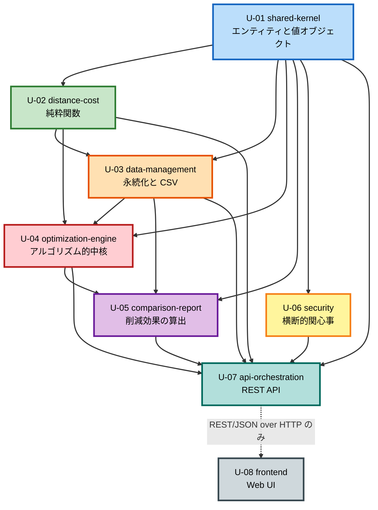

# ユニット依存関係（Unit of Work Dependency）

**作成日**: 2026-07-09
**ステージ**: INCEPTION - Units Generation - Part 2 (Generation)

---

## 1. 依存マトリクス

`X` = 直接依存する。`-` = 依存しない。

| ↓依存元 \ 依存先→ | U-01 shared-kernel | U-02 distance-cost | U-03 data-management | U-04 optimization-engine | U-05 comparison-report | U-06 security | U-07 api-orchestration | U-08 frontend |
|-------------------|:---:|:---:|:---:|:---:|:---:|:---:|:---:|:---:|
| **U-01** shared-kernel | - | - | - | - | - | - | - | - |
| **U-02** distance-cost | X | - | - | - | - | - | - | - |
| **U-03** data-management | X | X | - | - | - | - | - | - |
| **U-04** optimization-engine | X | X | X | - | - | - | - | - |
| **U-05** comparison-report | X | - | X | X | - | - | - | - |
| **U-06** security | X | - | - | - | - | - | - | - |
| **U-07** api-orchestration | X | X | X | X | X | X | - | - |
| **U-08** frontend | - | - | - | - | - | - | **REST のみ** | - |

**U-08 frontend の特殊性**: フロントエンドはバックエンドのいかなるユニットも**コードレベルでは import しない**。通信は REST API（JSON over HTTP）経由のみである（NFR-M05）。表中の「REST のみ」は、ネットワーク越しの契約依存であり、コンパイル時の依存ではないことを示す。

---

## 2. 循環依存の検証

**循環依存は存在しない。**

マトリクスの上三角がすべて `-` であることから、ユニットを `U-01 → U-02 → U-03 → U-04 → U-05 → U-06 → U-07 → U-08` の順に並べたとき、**依存はすべて番号の小さい方へ向かう**。これは有向非巡回グラフ（DAG）であることの十分条件である。

例外は `U-06 security` のみで、これは `U-01` にしか依存しない。番号順の位置に関わらず、どのユニットとも循環しない。

### 2.1 検証の詳細

| ユニット | 依存先 | 循環の可能性 |
|---------|-------|-------------|
| U-01 | なし | 根。循環しえない |
| U-02 | U-01 | U-01 は何にも依存しないため循環しない |
| U-03 | U-01, U-02 | U-02 は U-03 に依存しないため循環しない |
| U-04 | U-01, U-02, U-03 | いずれも U-04 に依存しない |
| U-05 | U-01, U-03, U-04 | いずれも U-05 に依存しない |
| U-06 | U-01 | U-01 は何にも依存しないため循環しない |
| U-07 | U-01〜U-06 | いずれも U-07 に依存しない |
| U-08 | なし（REST 契約のみ） | コードレベルの依存を持たない |

### 2.2 注意を要する 2 つの依存

**(a) U-03 data-management → U-02 distance-cost**

`A-02 PersistenceAdapter`（U-03 に所属）は、`P-02 RepositoryPort`（U-03 が定義）と `P-03 DistanceCachePort`（**U-02 が定義**）の双方を実装する。したがって U-03 は U-02 のポート定義に依存する。

これは**依存性逆転の原則に沿った正しい依存**である。U-02 はキャッシュの「契約」を定義するが、その実装（DB への書き込み）は知らない。U-02 が U-03 に依存することはない。

**(b) U-05 comparison-report → U-04 optimization-engine**

`S-06 ComparisonReportService`（U-05）は、最適化を `S-04 OptimizationService`（U-04）に委譲する（Follow-up Q1=A）。したがって U-05 は U-04 に依存する。

**逆向きの依存は存在しない。** U-04 は U-05 を知らない。これにより、比較レポートが独自の最適化ロジックを持つ余地が構造的に排除され、SC-01（削減効果の妥当性）が保証される。

---

## 3. 依存関係図



### テキスト代替

```text
U-01 shared-kernel（根。何にも依存しない）
  |
  +--> U-02 distance-cost（純粋関数。U-01 のみに依存）
  |       |
  |       +--> U-03 data-management（P-03 の実装のため U-02 に依存）
  |       |       |
  |       |       +--> U-04 optimization-engine
  |       |       |       |
  |       |       |       +--> U-05 comparison-report（最適化を U-04 に委譲）
  |       |       |       |
  |       |       +-------+--> U-07 api-orchestration
  |       |                       ^
  |       +-----------------------+
  |                               |
  +--> U-06 security -------------+
  |                               |
  +-------------------------------+
                                  |
                                  |  REST/JSON over HTTP のみ
                                  |  （コードレベルの依存なし。NFR-M05）
                                  v
                          U-08 frontend
```

---

## 4. 開発順序（クリティカルパス、Q7=A）

**依存順に逐次開発する。** 単一チームがすべてのユニットを担当する（Q8=A）。

```text
  1. U-01 shared-kernel        [クリティカルパス] 他の全ユニットの前提
       |
       v
  2. U-02 distance-cost        [クリティカルパス] U-03, U-04 の前提
       |
       v
  3. U-03 data-management      [クリティカルパス] U-04, U-05 の前提
       |
       v
  4. U-04 optimization-engine  [クリティカルパス] U-05 の前提。最大のリスク（NFR-P02）
       |
       v
  5. U-05 comparison-report                SC-01 に直結
       |
       v
  6. U-06 security             （U-01 完了後であれば、いつでも着手可能）
       |
       v
  7. U-07 api-orchestration    全ユニットの統合
       |
       v
  8. U-08 frontend             U-07 の REST API 契約が確定してから
```

### 4.1 並行化の余地（採用しないが記録する）

Q7=A により逐次開発を採用したが、依存関係上は以下が並行可能である。将来、複数チームで開発する場合の参考として記録する。

- **U-02 distance-cost** と **U-06 security** は、U-01 完了後に並行して着手できる（互いに依存しない）
- **U-05 comparison-report** は U-04 完了後、**U-06 security** と並行できる

### 4.2 クリティカルパス上の最大リスク

**U-04 optimization-engine** が最大のリスクである。

- NFR-P02: 最大 2,000 職員 × 200 施設 = 40 万の 0-1 決定変数に対し、厳密解法（MILP ソルバー）が制限時間 300 秒内に解を返すかは未検証（申し送り H-3）
- この検証は U-04 の NFR Requirements ステージで行う
- 厳密解法が不十分と判明した場合、`A-03b HeuristicSolverAdapter` を実装する。**`P-01 SolverPort` の背後にあるため、U-04 の内部変更のみで完結し、U-05 や U-07 に影響しない**（NFR-M01）

**リスク緩和の設計上の帰結**: U-04 のユニット境界が、この技術リスクを他ユニットから隔離している。

---

## 5. ユニット間の通信パターン

本 PoC はモノリス（Q1=A）である。

| 境界 | 通信方式 | 備考 |
|------|---------|------|
| U-01 ↔ U-02〜U-07 | プロセス内の型参照 | 共有カーネル。エンティティと値オブジェクトのみ |
| U-02 ↔ U-03, U-04, U-07 | プロセス内の関数呼び出し | 純粋関数。副作用なし |
| U-03 ↔ U-04, U-05, U-07 | プロセス内のインターフェース呼び出し | ポート経由 |
| U-04 ↔ U-05, U-07 | プロセス内のインターフェース呼び出し | `S-04` のメソッド |
| U-06 ↔ U-07 | ミドルウェアとして適用 | リクエスト処理連鎖に組み込む |
| **U-07 ↔ U-08** | **REST（JSON over HTTP）** | **NFR-M05。プロセス内の直接呼び出しを禁止する** |

---

## 6. モジュール境界の機械的強制

モノリスでは、モジュール境界は規約だけでは守られない。以下をビルド設定またはリンタ規則で機械的に検証する。**Code Generation ステージで実装し、Build and Test ステージで検証する。**

| 規則 | 検証内容 | 根拠 |
|------|---------|------|
| **R-1** | `src/frontend/` は `src/` 配下のバックエンドユニットを import してはならない | NFR-M05、申し送り H-5 |
| **R-2** | `src/shared-kernel/` は他のいかなるユニットも import してはならない | 依存グラフの根。循環依存の防止 |
| **R-3** | `src/distance-cost/` は `src/shared-kernel/` 以外を import してはならない | NFR-M02（純粋関数）。DB もファイルも時刻も参照できない構造を強制する |
| **R-4** | `src/optimization-engine/` は `src/comparison-report/` を import してはならない | U-04 → U-05 の逆向き依存を禁止し、SC-01 の妥当性を守る |
| **R-5** | いかなるユニットも `src/api-orchestration/` を import してはならない | U-07 は統合層であり、他から参照されない |
| **R-6** | 依存マトリクス（セクション 1）に `-` と記された組み合わせの import をすべて禁止する | 循環依存の防止 |

**R-3 の重要性**: この規則が守られる限り、`C-01 DistanceCostCalculator` は構造的に純粋関数であり続ける。INV-07（対称性）、INV-08（非負性）、INV-09（単調性）のプロパティベーステストが、モックを一切必要とせずに書ける。

---

## 7. 申し送り事項のユニット割り当て

| ID | 事項 | 担当ユニット | ステージ |
|----|------|------------|---------|
| **H-1** | 線形費用モデルは「タクシー費用の高額化」の非線形性を捉えない。距離帯モデルへの拡張を再検討する | **U-02 distance-cost** | Functional Design |
| **H-2** | 13 件の不変条件とプロパティ分類を「Testable Properties」セクションへ転記する（PBT-01） | **全ユニット**（主に U-02, U-04） | Functional Design |
| **H-3** | 40 万の 0-1 変数に対する厳密解法の実用性を評価する。不十分なら `A-03b` を実装する | **U-04 optimization-engine** | NFR Requirements |
| **H-4** | 技術スタック決定に PBT フレームワークを含める（PBT-09） | **U-01 shared-kernel**（バックエンド全体）、**U-08 frontend** | NFR Requirements |
| **H-5** | フロントエンドがバックエンドの型やモジュールを import していないことを機械的に検証する | **U-08 frontend** | Code Generation |
| **H-6** | 既存の公開基盤が提供する統制範囲（TLS 終端、アクセスログ、WAF の有無）を確認する | **U-06 security** | Infrastructure Design |
| **H-7** | 4 件の誤用・悪用シナリオへの統制を設計に反映する | **U-06 security** | 反映済み（Application Design） |
| **H-8** | PoC と実運用の差異。**Q9=B により、実運用のデプロイトポロジは PoC のユニット境界の対象外。ただし NFR-M05 の API 境界とエンドポイント URL の外部化は必須** | **U-07 api-orchestration**, **U-08 frontend** | Infrastructure Design |
| **H-9** | 「C3 不足のみ」の判定を厳密に行うか近似するかを決める | **U-04 optimization-engine** | Functional Design |
| **H-10** | ビッグMの下限が INV-12 を満たすことを示す | **U-04 optimization-engine** | Functional Design |

---

## 8. 技術スタック決定の調整

本システムはモノリスであり、バックエンドの全ユニット（U-01〜U-07）は同一の実行環境を共有する。したがって、技術スタックをユニットごとに独立に決定することはできない。

**調整方針**:

| 決定事項 | 決定するユニット | ステージ |
|---------|----------------|---------|
| バックエンドの言語・フレームワーク・DB | **U-01 shared-kernel** | NFR Requirements（1 周目） |
| PBT フレームワーク（バックエンド）（PBT-09） | **U-01 shared-kernel** | NFR Requirements（1 周目） |
| MILP ソルバー、発見的解法の要否 | **U-04 optimization-engine** | NFR Requirements（4 周目、H-3 の評価結果に基づく） |
| セッションストア、ハッシュアルゴリズム | **U-06 security** | NFR Requirements（6 周目） |
| フロントエンドの言語・フレームワーク・PBT フレームワーク | **U-08 frontend** | NFR Requirements（8 周目） |

**注意**: U-01 の NFR Requirements ステージが、バックエンド全体の技術基盤を決める。この決定は後続の全ユニットを拘束するため、当該ステージでは慎重な検討と明示的な承認が必要である。
