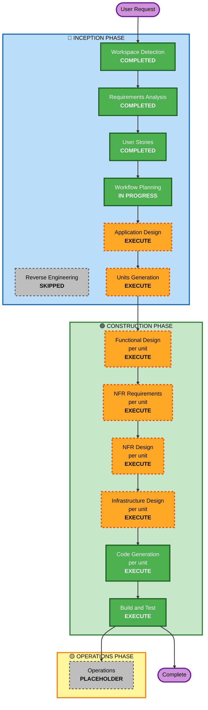

# Execution Plan（実行計画）

**作成日**: 2026-07-09
**ステージ**: INCEPTION - Workflow Planning
**参照**: `requirements.md` v1.3, `stories.md`（28 ストーリー）, `personas.md`（3 ペルソナ）

---

## 1. Detailed Analysis Summary（詳細分析サマリ）

### 1.1 Transformation Scope

**Brownfield 分析は適用外**（グリーンフィールドプロジェクト。既存コードなし）。

新規構築の対象は以下の 4 つの機能領域である。

| 領域 | 内容 | 特性 |
|------|------|------|
| データ管理 | 職員・施設・小学校区マスタ、イベント、従事可否申告、実績データ | CRUD + CSV 一括インポート/エクスポート |
| 距離・費用算出 | Haversine 距離、迂回係数、移動時間、移動費用 | **純粋関数**（副作用なし、外部依存なし） |
| 割当最適化 | 一般化割当問題（GAP）の求解、制約の診断とソフト化 | **アルゴリズム的中核**。最大 40 万の 0-1 決定変数 |
| 比較レポート | 過去イベントの再現、削減効果の算出と可視化 | 集計 + 出力 |

これらに加え、横断的関心事として **認証・認可・監査**（エピック E1）がある。

### 1.2 Change Impact Assessment

| 影響領域 | 該当 | 内容 |
|---------|:----:|------|
| **User-facing changes** | Yes | 割当担当者（P-01）とシステム管理者（P-02）が操作する Web アプリケーション全体が新規。現行の Excel 手作業による業務プロセスを置き換える |
| **Structural changes** | Yes | システムアーキテクチャそのものを新規に定義する。フロントエンド / バックエンドの API 境界（NFR-M05）が構造上の主要な決定 |
| **Data model changes** | Yes | 職員、施設、小学校区、イベント、**従事可否申告**（職員 × イベント）、割当結果、実績データ。従事可否申告を独立エンティティとする決定（requirements.md v1.3）がデータモデルの中核 |
| **API changes** | Yes | 全 API が新規。NFR-M05 により、フロントエンドとバックエンドは同一ホストに同居しても明示的な API 境界で分離する |
| **NFR impact** | Yes | 性能（最大 40 万 0-1 変数、制限時間 300 秒）、セキュリティ（個人情報、SECURITY-01〜15）、テスト（PBT-01〜10）のすべてに影響 |

### 1.3 Risk Assessment

- **Risk Level**: **Medium**
- **Rollback Complexity**: **Easy**（グリーンフィールド。破壊すべき既存システムが存在しない）
- **Testing Complexity**: **Complex**

**リスクの主要因**:

1. **最適化アルゴリズムの正当性**（技術リスク・高） — 割当結果は職員の実際の派遣先を決定する。制約違反は災害対応の失敗に直結する。**緩和策**: PBT 拡張を全面適用し、13 件の不変条件を検証する。特に INV-12（ビッグMによる C3 優先）は総当たり法をオラクルとして検証する（PBT-05）

2. **計算時間の実用性**（技術リスク・中） — 最大 2,000 職員 × 200 施設 = 40 万の 0-1 決定変数。厳密解法（MILP ソルバー）が制限時間 300 秒内に解を返すかは未検証。**緩和策**: NFR Requirements ステージで厳密解法と発見的解法のトレードオフを評価し、NFR-M01（アルゴリズム差し替え可能性）を設計に組み込む

3. **個人情報の取り扱い**（セキュリティリスク・中） — 職員の氏名・居住小学校区を扱う。**緩和策**: セキュリティ拡張を全面適用。PoC では仮名化データを投入（CQ7=B）。US-01（deny by default）、US-02（IP 許可リスト）が代償統制

4. **費用モデルの近似**（要件リスク・中） — A-04 の線形費用モデル（距離 × 単価）は、当初の課題である「タクシー費用の高額化」の非線形性（距離帯による交通手段の切替）を捉えない。**緩和策**: Functional Design ステージで再検討する。NFR-M03 により単価は設定として外部化されるため、後から距離帯モデルへ拡張できる余地を残す

5. **PoC と実運用の乖離**（移行リスク・低） — デプロイ構成（A-07）と従事可否の入力主体（A-08）が PoC と実運用で異なる。**緩和策**: NFR-M05（明示的な API 境界）と、従事可否申告の独立エンティティ化（FR-02.7）により、移行時の手戻りを防ぐ

**Risk Level を High ではなく Medium とした根拠**: アルゴリズムの正当性は高リスクだが、グリーンフィールドであり既存の本番システムを破壊する経路が存在しない。また PoC の位置づけ（CQ4=A）であり、実データ投入前に検証の機会がある。ロールバックは容易である。

---

## 2. Workflow Visualization

### Mermaid Diagram



### Text Alternative（テキスト表現)

```text
INCEPTION PHASE
  Stage 1: Workspace Detection    - COMPLETED  (Greenfield)
  Stage 2: Reverse Engineering    - SKIPPED    (No existing code)
  Stage 3: Requirements Analysis  - COMPLETED  (requirements.md v1.3)
  Stage 4: User Stories           - COMPLETED  (28 stories, 3 personas)
  Stage 5: Workflow Planning      - IN PROGRESS
  Stage 6: Application Design     - EXECUTE
  Stage 7: Units Generation       - EXECUTE

CONSTRUCTION PHASE  (per-unit loop)
  Stage 8:  Functional Design      - EXECUTE (per unit)
  Stage 9:  NFR Requirements       - EXECUTE (per unit)
  Stage 10: NFR Design             - EXECUTE (per unit)
  Stage 11: Infrastructure Design  - EXECUTE (per unit)
  Stage 12: Code Generation        - EXECUTE (per unit)
  Stage 13: Build and Test         - EXECUTE (after all units)

OPERATIONS PHASE
  Stage 14: Operations            - PLACEHOLDER
```

---

## 3. Phases to Execute

### 🔵 INCEPTION PHASE

- [x] **Workspace Detection** — COMPLETED（2026-07-09）
  - グリーンフィールドと判定

- [x] **Reverse Engineering** — SKIPPED
  - **Rationale**: 既存コードが存在しないため、解析対象がない

- [x] **Requirements Analysis** — COMPLETED（Comprehensive depth、requirements.md v1.3）
  - 17 問 + 8 問の明確化質問により、4 件の矛盾と 1 件の曖昧さを解消
  - User Stories ステージでデータモデルの誤りが判明し、v1.3 に修正

- [x] **User Stories** — COMPLETED（28 ストーリー、8 エピック、3 ペルソナ、13 不変条件、4 誤用シナリオ）

- [x] **Workflow Planning** — IN PROGRESS（本文書）

- [ ] **Application Design** — **EXECUTE**
  - **Rationale**: グリーンフィールドであり、すべてのコンポーネントとサービスが新規である。特に以下の設計判断が必要:
    - **NFR-M05 の実現**: フロントエンドとバックエンドの API 境界をどこに引くか。PoC では同一ホストに同居するが、実運用でオンプレミスへ分離できる構造にする
    - **最適化エンジンの分離**（NFR-M01）: アルゴリズムを差し替え可能にするため、エンジンをドメインロジックから分離する
    - **純粋関数としての距離算出**（NFR-M02）: 副作用を持たないモジュールとして切り出す
    - **セキュリティロジックの隔離**（SECURITY-11）: 認証・認可を専用モジュールに集約する
    - 従事可否申告を独立エンティティとするデータモデル（FR-02.7）のコンポーネント配置

- [ ] **Units Generation** — **EXECUTE**
  - **Rationale**: 本システムは技術的性質の大きく異なる複数の領域からなり、単一ユニットとして扱うのは適切でない:
    - **最適化エンジン**: アルゴリズム的中核。純粋な計算。PBT のオラクル検証（PBT-05）が必要
    - **距離・費用算出**: 純粋関数。オフライン動作。数学的性質（対称性、非負性、単調性）の検証が必要
    - **データ管理**: CRUD + CSV 一括処理。トランザクション整合性（fail closed）が必要
    - **比較レポート**: 集計と可視化
    - **Web UI / API**: 認証・認可・入力検証
  - これらは必要とする NFR、テスト戦略、技術スタックが異なる。ユニットに分解することで、各ユニットに適した Functional Design / NFR Requirements / NFR Design を個別に適用できる
  - 依存関係が存在する（最適化エンジンは距離算出に依存する）ため、`unit-of-work-dependency.md` による順序付けが必要

### 🟢 CONSTRUCTION PHASE（ユニットごとに反復）

- [ ] **Functional Design** — **EXECUTE**（per unit）
  - **Rationale**: 以下の 2 点により必須である:
    - **新規データモデルと複雑なビジネスロジック**: 従事可否申告エンティティ、5 つのハード制約（C1〜C5）、ソフト制約 S1、原因診断型の実行不可能処理（FR-04.5）、ベースライン再現の方法論（FR-05.1）
    - **PBT-01 が本ステージで必須**: プロパティベーステスト拡張が有効であり、PBT-01 は「Functional Design で各コンポーネントのテスト可能なプロパティを特定し、設計文書に記載する」ことをブロッキング制約として要求する。User Stories で 13 件の不変条件を先行特定済みであり、これを設計文書へ引き渡す
  - **A-04（費用の線形モデル）の再検討**を本ステージで行う

- [ ] **NFR Requirements** — **EXECUTE**（per unit）
  - **Rationale**: 以下の 3 点により必須である:
    - **技術スタックが未決定**（Q12=D「AI に提案してほしい」）。本ステージで決定する
    - **性能要件の検証**（NFR-P02）: 最大 40 万の 0-1 変数に対し、厳密解法（MILP ソルバー）が制限時間 300 秒内に解を返すかを評価する。厳密解法と発見的解法のトレードオフを提示する
    - **PBT-09 が本ステージで必須**: プロパティベーステストのフレームワーク選定を技術スタック決定に含める必要がある（言語により Hypothesis / fast-check / jqwik など）

- [ ] **NFR Design** — **EXECUTE**（per unit）
  - **Rationale**: NFR Requirements が実行されるため、規則により本ステージも実行する。セキュリティ拡張が有効であり、SECURITY-01（保存時・転送時の暗号化）、SECURITY-03（構造化ログ、PII の除外）、SECURITY-04（HTTP セキュリティヘッダ）、SECURITY-05（入力検証）、SECURITY-11（レート制限、セキュリティロジックの隔離）、SECURITY-12（認証・資格情報管理）、SECURITY-15（fail closed、グローバルエラーハンドラ）のパターンを設計に組み込む

- [ ] **Infrastructure Design** — **EXECUTE**（per unit）
  - **Rationale**: 以下により必須である:
    - **デプロイ構成の具体化**: PoC は単一のインターネット側サーバーにフロントエンドとバックエンドを同居させる（A-07）
    - **SECURITY-07 の文書化された例外の検証**: NFR-S10.1（ログイン制限）と NFR-S10.2（庁内出口 IP の許可リスト）が具体的に設計されていることを本ステージで検証する。これが設計されない場合、SECURITY-07 のブロッキング所見となる
    - **既存の公開基盤が提供する統制範囲の確認**（A-06）: TLS 終端、アクセスログ取得の有無、WAF の有無。SECURITY-02（ネットワーク中継機器のアクセスログ）の適合判定に必要
    - SECURITY-01（保存時暗号化）、SECURITY-06（最小権限）、SECURITY-14（アラート、ログ保全、保持期間）の具体化

- [ ] **Code Generation** — **EXECUTE**（ALWAYS、per unit）
  - **Rationale**: 実装計画とコード生成が必要。Part 1（計画）と Part 2（生成）の 2 部構成で実行する

- [ ] **Build and Test** — **EXECUTE**（ALWAYS、全ユニット完了後）
  - **Rationale**: ビルド、単体テスト、統合テストの手順が必要。PBT-08 により、プロパティベーステストを CI に組み込み、失敗時にシードをログ出力する手順を含める

### 🟡 OPERATIONS PHASE

- [ ] **Operations** — PLACEHOLDER
  - **Rationale**: 将来のデプロイ・監視ワークフロー用のプレースホルダー。現時点ではビルドとテストは CONSTRUCTION フェーズで扱う

---

## 4. Adaptive Detail Level

実行されるすべてのステージは、定義されたすべての成果物を作成する。成果物内の**詳細度**は問題の複雑さに応じて調整する。

| ステージ | 詳細度 | 根拠 |
|---------|--------|------|
| Application Design | **Comprehensive** | すべてのコンポーネントが新規。API 境界の設計が実運用移行を左右する |
| Units Generation | **Standard** | ユニット数は 5 前後と見込まれ、依存関係も明瞭 |
| Functional Design | **Comprehensive**（最適化エンジン）/ **Standard**（その他） | 最適化エンジンは制約とプロパティの記述が中核。PBT-01 の入力となる |
| NFR Requirements | **Comprehensive** | 技術スタック未決定、性能要件の実証が必要 |
| NFR Design | **Standard** | セキュリティ拡張のパターン適用が中心 |
| Infrastructure Design | **Standard** | PoC は単一サーバー構成であり、構成自体は単純 |
| Code Generation | **Comprehensive** | セキュリティ・PBT の両拡張がブロッキング制約として適用される |
| Build and Test | **Standard** | |

---

## 5. Success Criteria（成功基準）

### Primary Goal

現行の職場単位割当を、居住地を考慮した数理最適化に置き換え、**総移動時間と総移動費用の削減効果を数値で示すこと**（SC-01）、および**実際の割当業務で使用でき、担当者の作業工数が削減されること**（SC-02）。

### Key Deliverables

1. 割当最適化エンジン（一般化割当問題の求解、5 ハード制約 + 1 ソフト制約、原因診断型の実行不可能処理）
2. 距離・移動時間・移動費用の算出モジュール（純粋関数、オフライン動作）
3. マスタデータ管理と従事可否申告管理（CSV 一括インポート、fail closed）
4. Web UI（割当結果の確認、手動調整、ピン留め再最適化、パラメータ設定）
5. ベースライン比較レポート（過去イベントの再現、削減効果の算出と CSV エクスポート）
6. 認証・認可・監査ログ（deny by default、IP 許可リスト、追記専用の監査ログ）
7. テストスイート（例示ベーステスト + プロパティベーステスト、13 不変条件を検証）

### Quality Gates

| ゲート | 基準 | ステージ |
|-------|------|---------|
| **QG-1 プロパティ特定** | 13 件の不変条件がすべて Functional Design の設計文書に記載され、プロパティ分類が付与されている（PBT-01） | Functional Design |
| **QG-2 フレームワーク選定** | プロパティベーステストのフレームワークが技術スタック決定に記載され、依存関係に含まれている（PBT-09） | NFR Requirements |
| **QG-3 ネットワーク統制** | NFR-S10.1（ログイン制限）と NFR-S10.2（庁内出口 IP 許可リスト）が具体的に設計されている（SECURITY-07 の例外の代償統制） | Infrastructure Design |
| **QG-4 オラクル検証** | 小規模インスタンス（職員 10 名、施設 3 か所）の総当たり法をオラクルとし、最適化エンジンの出力が一致する（PBT-05、INV-12） | Code Generation |
| **QG-5 不変条件の検証** | 13 件の不変条件すべてに対しプロパティベーステストが存在し、シュリンキングとシード出力が有効である（PBT-03, PBT-08） | Code Generation |
| **QG-6 例示ベーステストの併存** | 業務上重要なパス（US-16, US-18, US-19, US-27）に例示ベーステストが存在する（PBT-10） | Code Generation |
| **QG-7 セキュリティ適合** | SECURITY-01〜15 のすべてが「適合」または「N/A（根拠付き）」である | Code Generation, Build and Test |
| **QG-8 削減効果の実証** | ベースライン比較レポートが、総移動時間・総移動費用の削減量と削減率を出力する（SC-01） | Build and Test |

---

## 6. Estimated Scope

- **実行ステージ数**: 8（Application Design、Units Generation、および CONSTRUCTION フェーズの 6 ステージ）
- **スキップステージ数**: 1（Reverse Engineering）
- **プレースホルダー**: 1（Operations）
- **想定ユニット数**: 5 前後（Units Generation ステージで確定）
- **CONSTRUCTION フェーズの反復回数**: ユニット数 × 5 ステージ（Functional Design 〜 Code Generation）+ Build and Test 1 回

**所要期間の見積もりは行わない**。AI-DLC の各ステージはユーザーの承認を伴う対話的な進行であり、実時間の見積もりは意味を持たない。

---

## 7. 有効な拡張機能と適用ステージ

| 拡張 | 有効 | 適用されるステージ |
|------|:----:|------------------|
| security/baseline | **Yes** | Application Design（SECURITY-11）、NFR Design（SECURITY-01, 03, 04, 05, 11, 12, 15）、Infrastructure Design（SECURITY-01, 02, 06, 07, 14）、Code Generation（全ルール）、Build and Test（SECURITY-10） |
| testing/property-based | **Yes** | Functional Design（PBT-01）、NFR Requirements（PBT-09）、Code Generation（PBT-01〜10）、Build and Test（PBT-08） |
| resiliency/baseline | **No** | 適用しない（CQ4=A により次フェーズへ延期）。ルールファイルは未ロード |

---

## 8. 後続ステージへの申し送り事項

| ID | 事項 | 引き渡し先ステージ |
|----|------|------------------|
| **H-1** | A-04（費用の線形モデル）は「タクシー費用の高額化」の非線形性を捉えない。距離帯による交通手段の切替モデルへの拡張を検討すること | Functional Design |
| **H-2** | 13 件の不変条件（INV-01〜INV-13）とプロパティ分類を、設計文書の「Testable Properties」セクションへ転記すること（PBT-01） | Functional Design |
| **H-3** | 最大 40 万の 0-1 変数に対する厳密解法の実用性を評価し、厳密解法と発見的解法のトレードオフを提示すること（NFR-P02） | NFR Requirements |
| **H-4** | 技術スタック決定にプロパティベーステストのフレームワークを含めること（PBT-09） | NFR Requirements |
| **H-5** | NFR-M05（明示的な API 境界）を満たすこと。PoC では同一ホストに同居するが、プロセス内の直接呼び出しで結合してはならない | Application Design, Code Generation |
| **H-6** | 既存の公開基盤が提供する統制範囲（TLS 終端、アクセスログ、WAF の有無）を確認すること。SECURITY-02 の適合判定に必要（A-06） | Infrastructure Design |
| **H-7** | 4 件の誤用・悪用シナリオ（MU-01 IDOR、MU-02 CSV 数式インジェクション、MU-03 総当たりログイン、MU-04 監査ログ隠蔽）に対する統制を設計に反映すること（SECURITY-11） | Application Design, NFR Design |
| **H-8** | PoC と実運用の差異は 2 点（A-07 デプロイ構成、A-08 従事可否の入力主体）。実運用移行時の追加要件を設計文書に注記すること | Application Design, Infrastructure Design |
